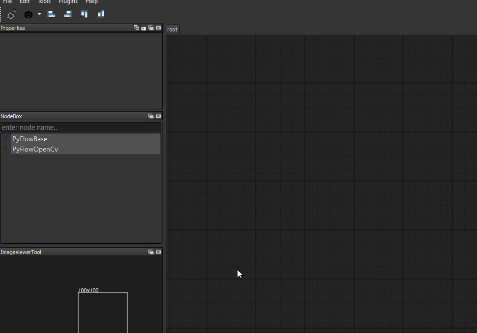
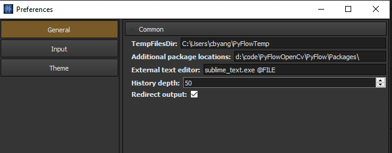
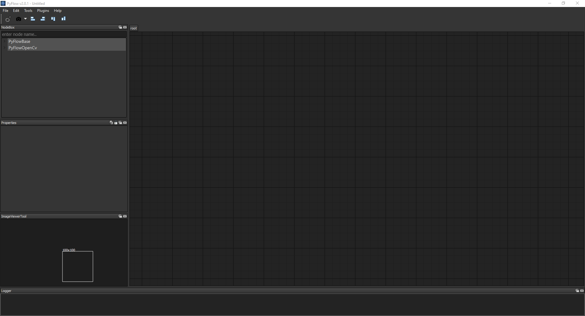

# PyFlowOpenCv
**PyFlow** is a general-purpose Visual Dataflow Programming library. Nodes represent algorithms with certain inputs and outputs. Connections transfer data from the output (source) of the first node to the input (sink) of the second one.

**PyFlowOpencv** is a visual scripting extension for PyFlow for OpenCV. **PyFlowOpencv** enable you learn Computer vision without writing a single line of code, which is great for rapid prototyping and learning. Plenty of OpenCV functions are available as building blocks in PyFlowOpenCv that can be combined in a graphical user interface with just a few mouse clicks.A quick demo on how **PyFlowOpenCv** works for a face detection.

 

Learning OpenCV is quite challenging for most of the beginners. PyFlowOpenCv make the learning curve of Opencv much smoother. You do not need to write any code, just drag and drop the diagram. 


# Installation
**PyFlowOpenCv is not a standalone software, it is a extension package of PyFlow. PyFlow has to be installed first.** You can refer to [PyFlow Project](https://github.com/wonderworks-software/PyFlow)  to install PyFlow.

The easy way to install PyFlow is::
```bash
    pip install git+https://github.com/wonderworks-software/PyFlow.git@master
```

After PyFlow installed through pip or setup.py.

Clone or download PyFlowOpenCV repository
```bash
    git clone https://github.com/wonderworks-software/PyFlowOpenCv
```
Install requirements for your use case::

```bash
    pip install -r requirements.txt
```

To run the program in standalone mode, you can invoke pyflow.exe on windows or pyflow on unix OS. Program is located inside PATH/TO/PYTHON/Scripts. You can also 
run pyflow.py in the root folder of PyFlow(not PyFlowOpenCV) project.

You can enable the PyFlowOpenCv package by one of the following ways ( Just pick one, not all).

- put the addition package path to 'Additional package locations' on preferences dialog.Make sure you add path of PyFlow/Packages under PyFlowOpenCv project to the 'additional package location' edit.
 
- Copy the PyFlowOpenCv package to .PyFlow/Packages
- User can add location of package to env variable for PYTHONPATH
- Paths listed in PYFLOW_PACKAGES_PATHS env variable (; separated string)

If everything works out, you should able to see 'PyFlowOpenCv' in your NodeBox dialog of the GUI.

 


## Getting Started

We have [documentation](https://pyflowopencv.readthedocs.io/en/latest/)

## Authors

**Pedro Cabrera** - [Pedro Cabrera](https://github.com/pedroCabrera)

**Changbo Yang** - [Changbo Yang](https://github.com/bobosky)

See also the list of [contributors](https://github.com/wonderworks-software/PyFlowOpencv/contributors) who participated in this project.

## Discussion

Join us to our [discord channel](https://discord.gg/SwmkqMj) and ask anything related to project! Please also let us know if you want more OpenCV features in PyFlowOpenCv.