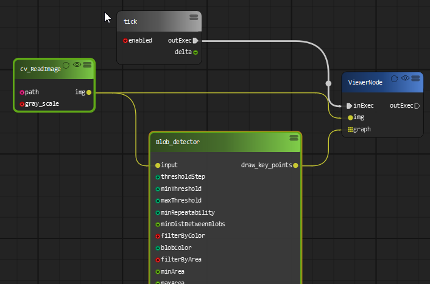
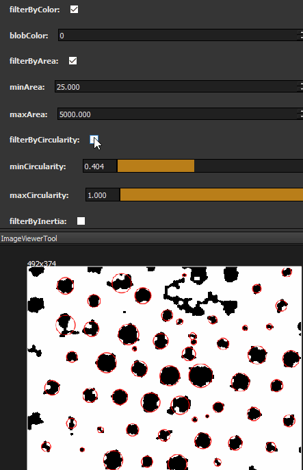

Blob detection 
=============================

In this example, we are going to create a project can detect blobs using OpenCV.
A blob is a group of connected pixels in an image that share some common property.

We are going to use blob_detection node to detect the blob in the image.

The algorithm for extracting blobs from an image works in the folllowing steps:

* Convert the source image to binary images by applying thresholding with several thresholds from minThreshold (inclusive) to maxThreshold (exclusive) with distance thresholdStep between neighboring thresholds.
* Extract connected components from every binary image by findContours and calculate their centers.
* Group centers from several binary images by their coordinates. Close centers form one group that corresponds to one blob, which is controlled by the minDistBetweenBlobs parameter.
* From the groups, estimate final centers of blobs and their radiuses and return as locations and sizes of key points.

This node can also performs several filtrations of returned blobs. You should set filterBy* to true/false to turn on/off corresponding filtration. Available filtrations:

* By color. This filter compares the intensity of a binary image at the center of a blob to blobColor. If they differ, the blob is filtered out. Use blobColor = 0 to extract dark blobs and blobColor = 255 to extract light blobs.
* By area. Extracted blobs have an area between minArea (inclusive) and maxArea (exclusive).
* By circularity. Extracted blobs have circularity ( 4∗π∗Areaperimeter∗perimeter) between minCircularity (inclusive) and maxCircularity (exclusive).
* By ratio of the minimum inertia to maximum inertia. Extracted blobs have this ratio between minInertiaRatio (inclusive) and maxInertiaRatio (exclusive).
* By convexity. Extracted blobs have convexity (area / area of blob convex hull) between minConvexity (inclusive) and maxConvexity (exclusive).

By changing the filteration parameters in property dialog. The result image will be changed in realtime.

