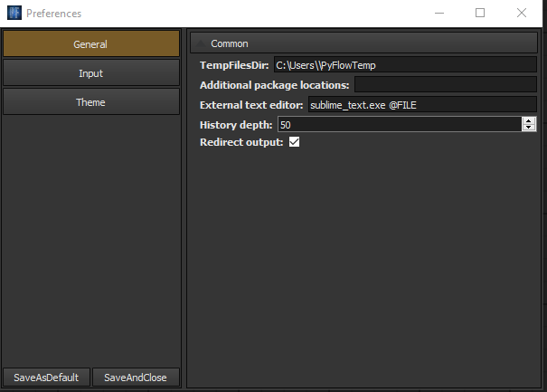

About this project
==================

**PyFlowOpencv** is a visual scripting extention for PyFlow. 

Aim
********

Learning OpenCV is quite challenging for most of the beginners. PyFlowOpenCv make the learing curve of Opencv much smoother. You do not need to write any code, just drag and drop the diagram. 

Installation
==================
PyFlowOpenCv is not a standalone softwarea, it is a extention package of PyFlow. PyFlow has to be installed first. You can refer to `PyFlow <https://github.com/wonderworks-software/PyFlow>`_  to install PyFlow.
After PyFlow installed through pip or setup.py.

Clone or download repository::

    git clone https://github.com/bobosky/PyFlowOpenCv

Install requirements for your use case::

    pip install -r requirements.txt

To run the program in standalone mode, run pyflow.py in the root folder of PyFlow project. You can also invoke pyflow.exe on windows or pyflow on unix OS. Program is located inside PATH/TO/PYTHON/Scripts.

To enable the PyFlowOpenCv package, user can add location of package to env variable for PYTHONPATH, or via pyflow editor itself in preferences.

If everything works out, you should able to see 'PyFlowOpenCv' in your nodebox dialog of the GUI.

.. image:: res/all_window.png

.. Nodes
.. ==========

.. Pins
.. ==========

.. Open an image
.. =====================

.. Open a video file 
.. =====================

.. Open a webcam 
.. =====================

.. Basic image processing
.. =========================

.. Image filter
.. ===============

.. Color Conversion
.. ===================

.. Keypoint detection and feature extractioin
.. ===============

.. Deep learning Moduals
.. ===============