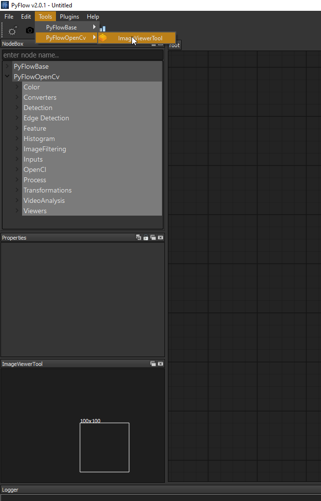
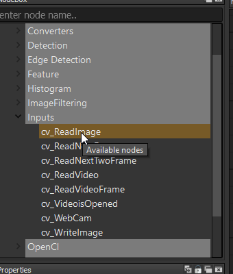
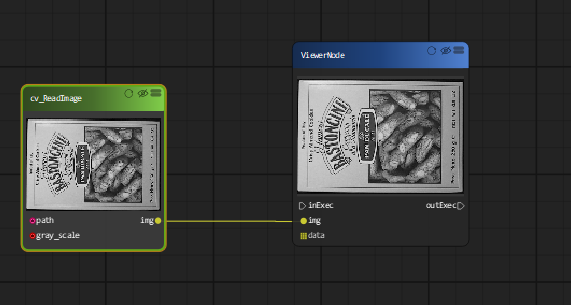
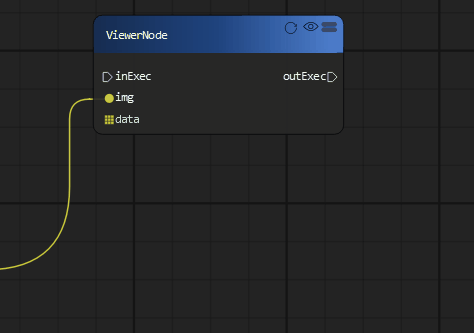

Open and Display a image
=============================
Now let's begin your first OpenCv diagram; loading a image and display it.

Before we start we start the first example, please go to Menu : Tools > PyFlowOpencv > imageveiwtool and click. This step will open a image viewer windows, so that you can inspect your image process result. 

Now, go to NodeBox windows on GUI, expand PyFlowOpencv>Inputs , you will find Cv_ReadImage node, drag it to the right side diagram area.

Next, Go to PyFlowOpencv>viewers>ViewerNode and drag. Connect the endpoint 'image' of Cv_ReadImage to the endpoint 'image' of ViewerNode.

Then go to the property dialog of the gui, choose the image file you want to open.

..  image:: res/readimage_path_set.png

Now, your first diagram is finished. To view the image, you may need to click the 'refresh' button on the ViewerNode.

The whole process should be worked as follows.

..  image:: res/load_image_display.gif

After you created your first diagram, you may want to save your diagram by click Menu 'File' > 'Save'