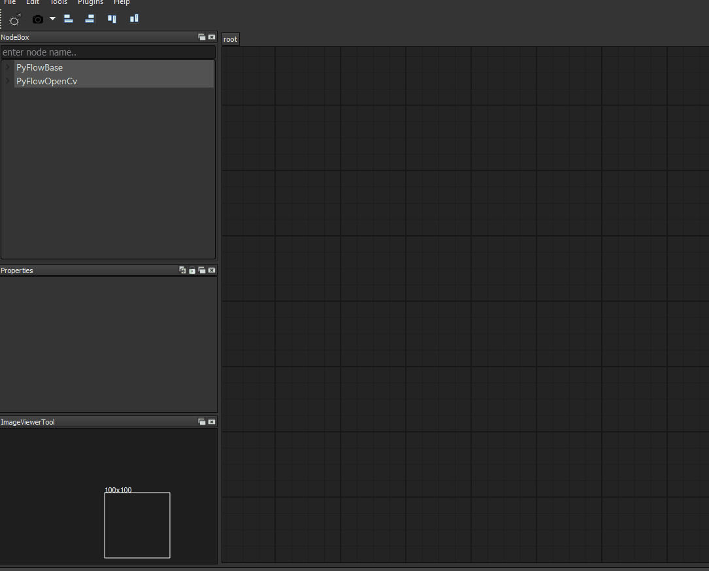
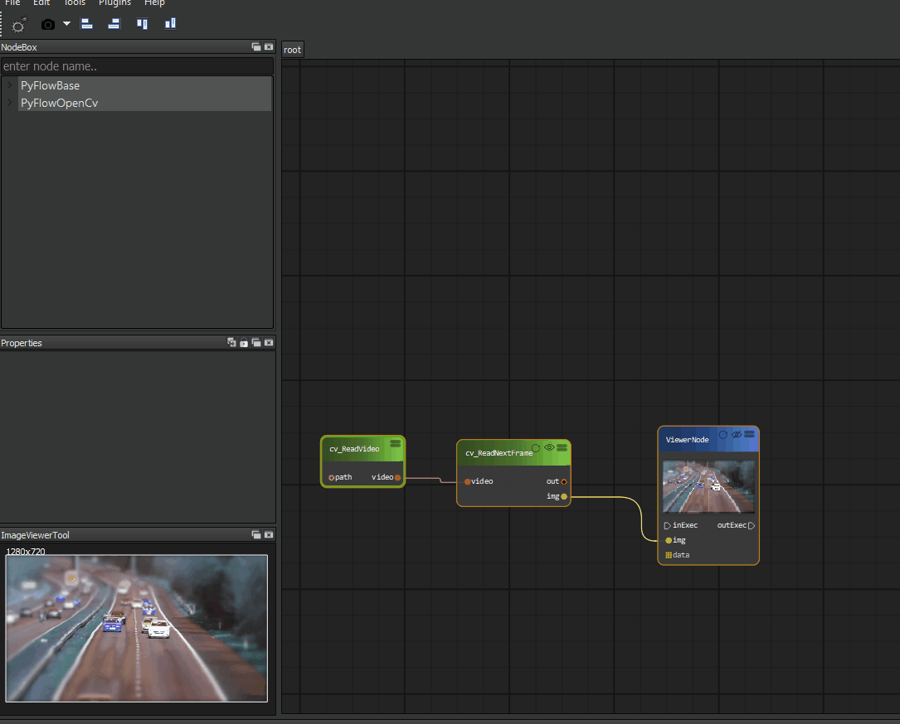

Open and play a video 
=============================

To open a video you need create a Cv_ReadVideo node similar to our first example. Then connect it to Cv_ReadNextFrame node to get a frame from the video. At last, you need the ViewNode to display you video.

However, this diagram can only display the first frame for you, we still need to create a loop to play every frame by adding a 'tick' node.

**Tips**: You can search the node by its name using the search box on the top of the NodeBox dialog.