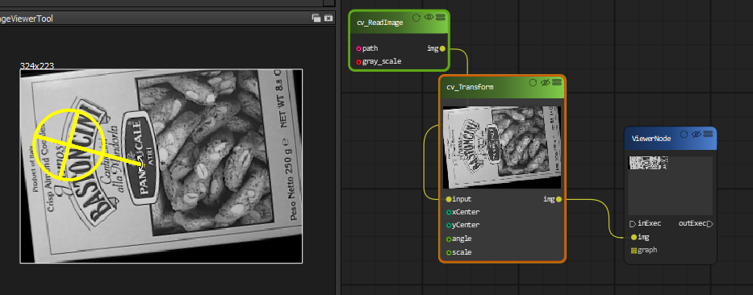

Image Filter
=============================

Continue our video example, we will add a image filter block to blur the video image.

..  image:: res/video_blur.gif

You can even adjust the smoothing factor on realtime.

Image Threshold
===================
See how image threshold works.

..  image:: res/threshold.gif

Image Transform(Rotation) 
===================
Image rotation can be done with the CV_Transform block, which provide a joystick like tool to choose the rotation center and angle.

