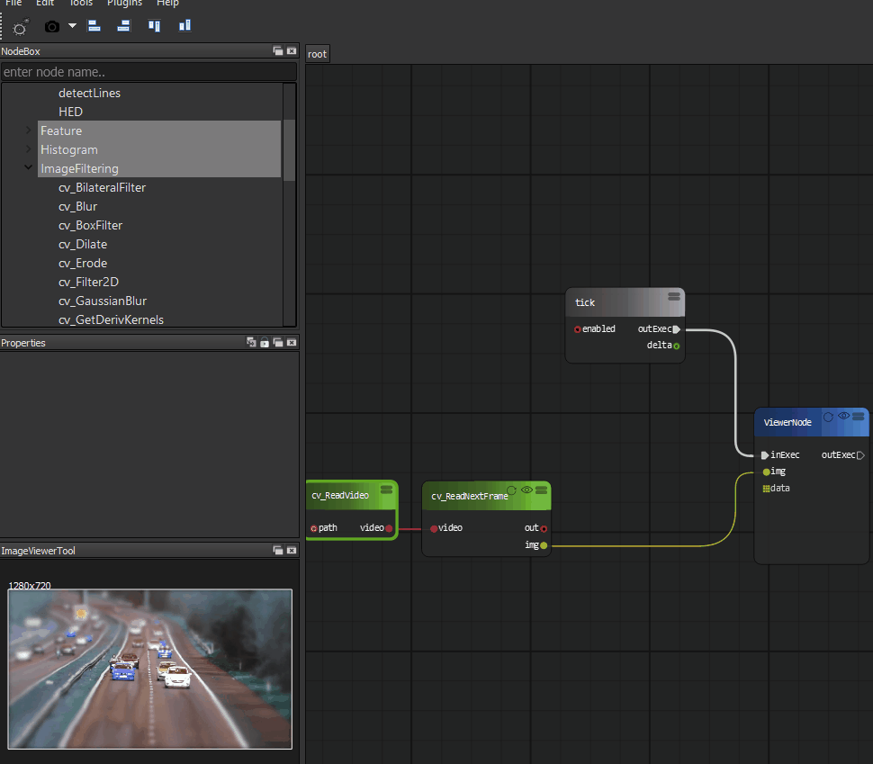
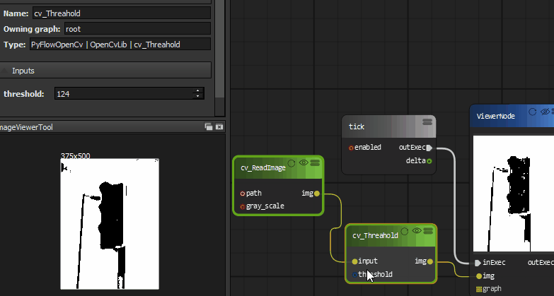

Image Filter
=============================

Continue our video example, we will add a image filter to blur the video image.

You can even adjust the blur factor on realtime.

Image Threshold
===================
See how image threshold works.

