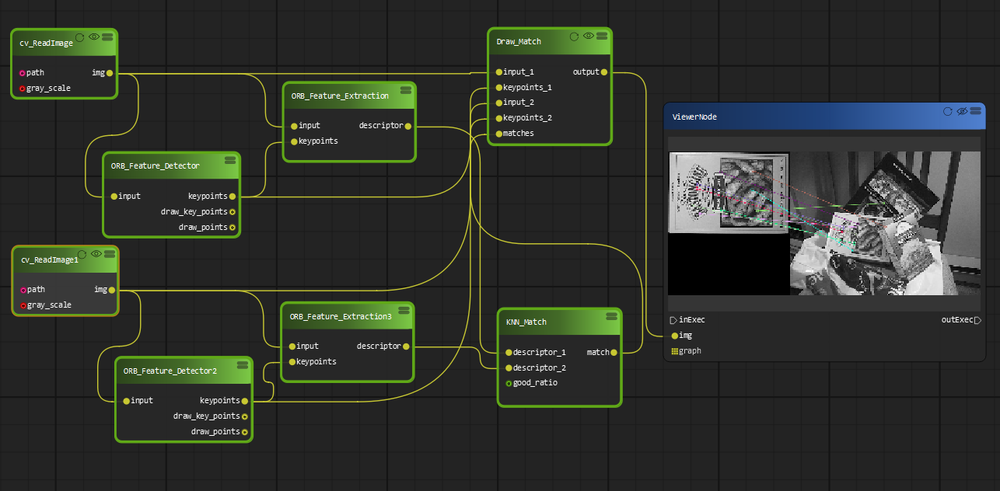
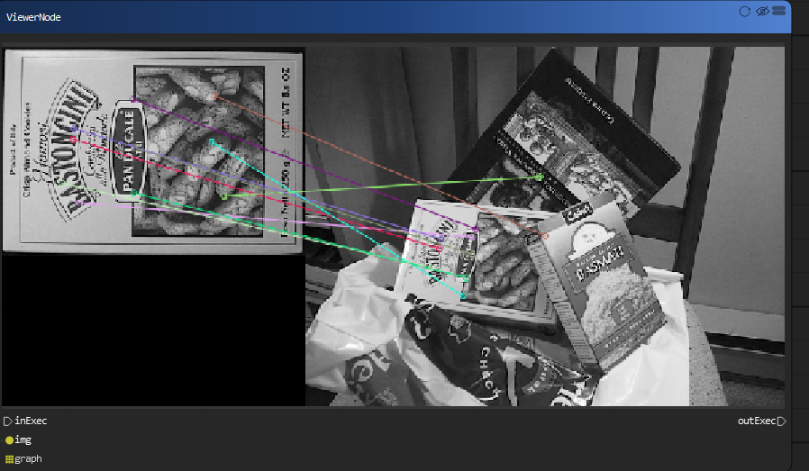

Feature extraction and matching
******************

Welcome to a feature matching tutorial with PyFlowOpenCv. We start with the image that we're hoping to find, and then we can search for this image within another image. The beauty here is that the image does not need to be the same lighting, angle, rotation...etc. The features just need to match up.

To start, we need some sample images. Our "template," or image we're going to try to match:

..  image:: res/box.png

Then our image to search for this template in:

..  image:: res/box_in_scene.png

Feature detection
=======================
OpenCV includes the following feature extraction algorithms:

* Haris corner detection
* Shi-Tomasi corner detection
* SIFT (Scale-Invariant Feature Transform)
* SURF (Speeded-Up Robust Features)
* FAST algorithm for corner detection
* ORB (Oriented FAST and Rotated Brief)

SIFT, SURF are patented and are not available free for commercial use. It requires opencv-contrib to be installed in order to use them

Feature matching
======================

Feature matching between images in OpenCV can be done with Brute-Force matcher or FLANN based matcher.

Brute-Force (BF) Matcher
-----------------------------
BF Matcher matches the descriptor of a feature from one image with all other features of another image and returns the match based on the distance. It is slow since it checks match with all the features

FLANN based matcher
----------------------
Fast Library for Approximate Nearest Neighbors (FLANN) is optimised to find the matches with search even with large datasets hence its fast when compared to Brute-Force matcher.
With ORB and FLANN matcher let us extract the tesla book cover from the second image and correct the rotation with respect to the first image

We are going to build the diagram in the following way:

* open the template image and target image
* Initialize the ORB detector and detect the keypoints in query image and scene.
* Compute the descriptors belonging to both the images.
* Match the keypoints using KNNMatcher.
* Show the matched images.

