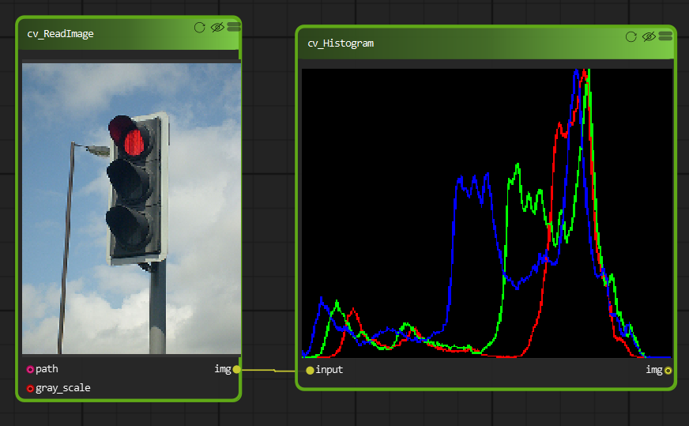

Image Histogram
=============================

A histogram is a very important tool in Image processing. It is a graphical representation of the distribution of data. An image histogram gives a graphical representation of the distribution of pixel intensities in a digital image.

