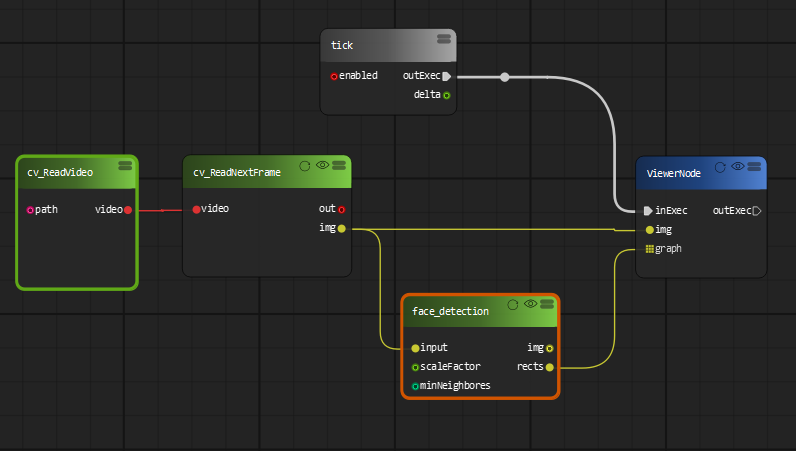
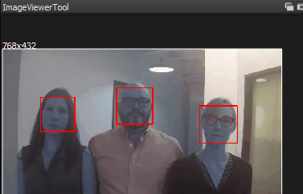
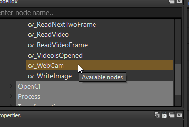

Face detection by Haar Classifier
=============================

Face detection is a technique that identifies or locates human faces in digital images. Face detection in OpenCV is performed by using classifiers. A classifier is essentially an algorithm that decides whether a given image is positive(face) or negative(not a face). A classifier needs to be trained on thousands of images with and without faces. OpenCV come with a pre-trained Haar feature based face detection classifiers, which can readily be used in a PyFlowOpenCv.

Now let's create a OpenCV data flow diagram can detection the face in a video or a WebCam.

The result video on videoviewer node will be something like this:

Under the hood, we are using the detectMultiscale module of the OpenCV haar feature classifier. This function will return a rectangle with coordinates(x,y,w,h) around the detected face. This function has two important parameters which have to be tuned according to the data.

* scalefactor: In a group photo, there may be some faces which are near the camera than others. Naturally, such faces would appear more prominent than the ones behind. This factor compensates for that.

* minNeighbors: This parameter specifies the number of neighbors a rectangle should have to be called a face. You can read more about it here.

You can change the two parameters on the fly and see how the parameter changed the detection result. 

..  image:: res/face_detection_parameters.png

If you want to detect face from the WebCam, just drag a WebCam node to the diagram instead of the ReadVideo node:

