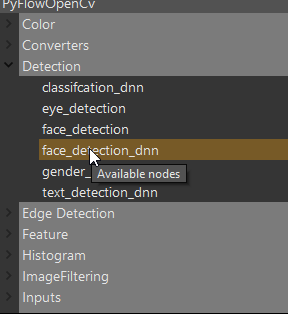
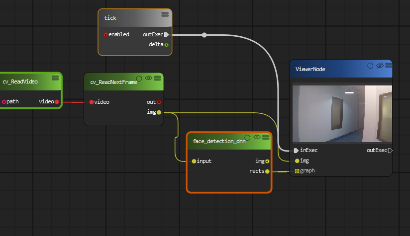
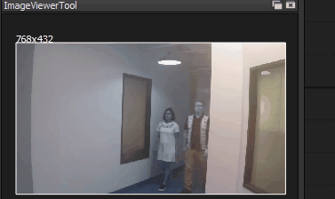

Face Detection by Convolutional Neural Network (CNN) detectors
=============================

Starting from version 3.3, OpenCV supports the Caffe, TensorFlow, and Torch/PyTorch frameworks. OpenCV can load pre-trained CNN model directly.

In this example, we are going to build a computer vision diagram can detect face using Deep Learning Neural Network. We are going to use a new node named 'face_detection_dnn'.

Similar to our previous face Detection example, we are going to create the following diagram:

The Detection result will be much stable than our previous example using Haar feature.

