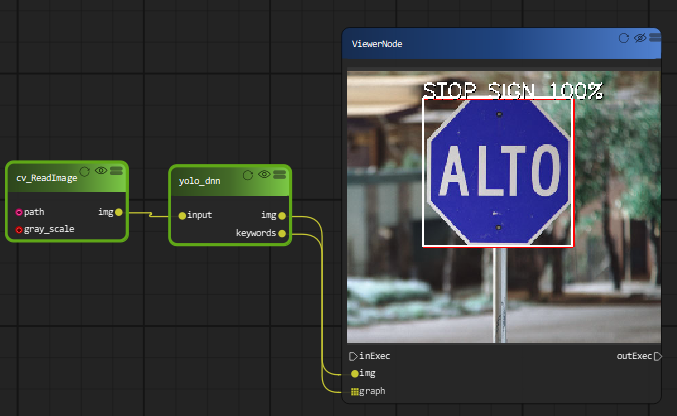
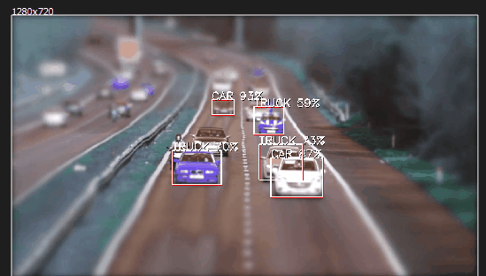
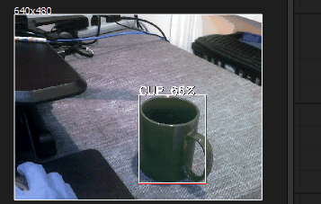

Text Detection by deep learning
=============================

EAST Detector for Text Detection
------------------------------------

OpenCV’s EAST(Efficient and Accurate Scene Text Detection ) text detector is a deep learning model, based on a novel architecture and training pattern. It is capable of running at near real-time at 13 FPS on 720p images and obtains state-of-the-art text detection accuracy.

`Link to paper <https://arxiv.org/pdf/1704.03155.pdf>`_

OpenCV’s text detector implementation of EAST is quite robust, capable of localizing text even when it’s blurred, reflective, or partially obscured.

..  image:: res/text_detection.png

This is an example of text detection on a webcam.

..  image:: res/text_detection_video.gif

YOLO object detection with OpenCV
====================================

You only look once (YOLO) is a state-of-the-art, real-time object detection system. On a Pascal Titan X it processes images at 30 FPS and has a mAP of 57.9% on COCO test-dev.

Due to the large size of the yolo model file, we only includes a tiny yolo model with the package. 

You can also use YOLO detector on realtime webcam.

