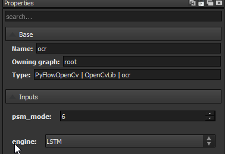
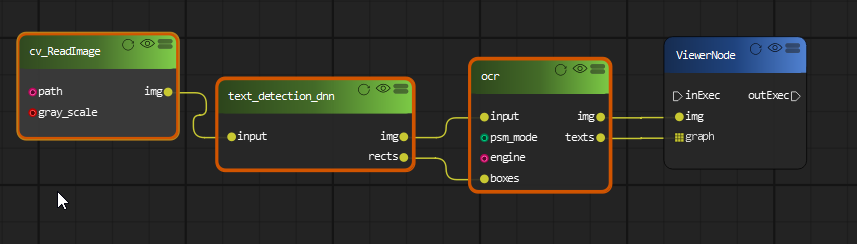
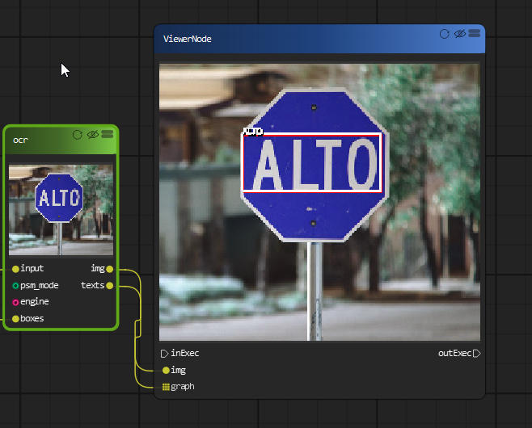

Text Detection by deep learning and Recognition
=============================

EAST Detector for Text Detection
------------------------------------

OpenCV’s EAST(Efficient and Accurate Scene Text Detection ) text detector is a deep learning model, based on a novel architecture and training pattern. It is capable of running at near real-time at 13 FPS on 720p images and obtains state-of-the-art text detection accuracy.

`Link to paper <https://arxiv.org/pdf/1704.03155.pdf>`_

OpenCV’s text detector implementation of EAST is quite robust, capable of localizing text even when it’s blurred, reflective, or partially obscured.

..  image:: res/text_detection.png

This is an example of text detection on a webcam.

..  image:: res/text_detection_video.gif

OCR by Tesseract
----------------------
Tesseract is an open source text recognition (OCR) Engine, available under the Apache 2.0 license. Installing tesseract on Windows is easy with the precompiled binaries found `here <https://github.com/tesseract-ocr/tesseract/wiki>`_. Do not forget to edit “path” environment variable and add tesseract path. For Linux or Mac installation it is installed with few commands.

There is also one more important argument, OCR engine mode (oem). Tesseract 4 has two OCR engines — Legacy Tesseract engine and LSTM engine. There are four modes of operation chosen using the --oem option:

*   Legacy engine only.
*   Neural nets LSTM engine only.
*   Legacy + LSTM engines.
*   Default, based on what is available.

With PyFlowOpenCv, you can choose the the engine in the property dialog:

Page Segmentation Mode (--psm). That affects how Tesseract splits image in lines of text and words. Pick the one which works best for you:

0. Orientation and script detection (OSD) only.
1. Automatic page segmentation with OSD.
2.    Automatic page segmentation, but no OSD, or OCR.
3.    Fully automatic page segmentation, but no OSD. (Default)
4.    Assume a single column of text of variable sizes.
5.   Assume a single uniform block of vertically aligned text.
6.   Assume a single uniform block of text.
7.   Treat the image as a single text line.
8.   Treat the image as a single word.
9.   Treat the image as a single word in a circle.
10.   Treat the image as a single character.
11.   Sparse text. Find as much text as possible in no particular order.
12.   Sparse text with OSD.
13.   Raw line. Treat the image as a single text line, bypassing hacks that are Tesseract-specific.

You can also choose the page segmentation mode in property dialog, but since we feed the text region to OCR engine, mode 6 should work best in most cases.

To recognize the text in the image, we will use the EAST text detection node first, and feed the detected region to OCR engine.

And you should able to get all the text in the image.

YOLO object detection with OpenCV
====================================

You only look once (YOLO) is a state-of-the-art, real-time object detection system. On a Pascal Titan X it processes images at 30 FPS and has a mAP of 57.9% on COCO test-dev.

Due to the large size of the yolo model file, we only includes a tiny yolo model with the package. 

..  image:: res/yolo.png

..  image:: res/yolo_video.gif

You can also use YOLO detector on realtime webcam.

..  image:: res/yolo_video_webcam.gif

