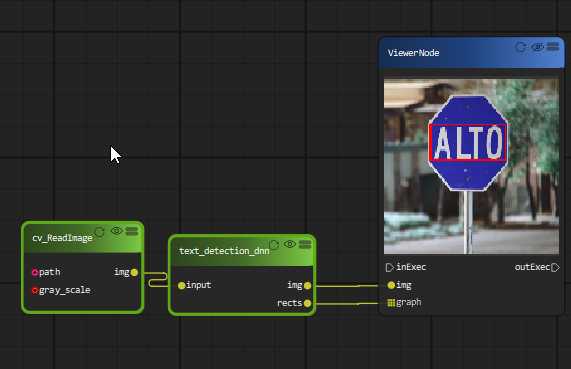
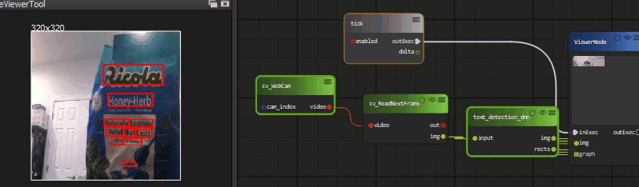

Text Detection by deep learning
=============================

EAST Detector for Text Detection
------------------------------------

OpenCV’s EAST(Efficient and Accurate Scene Text Detection ) text detector is a deep learning model, based on a novel architecture and training pattern. It is capable of running at near real-time at 13 FPS on 720p images and obtains state-of-the-art text detection accuracy.

`Link to paper <https://arxiv.org/pdf/1704.03155.pdf>`_

OpenCV’s text detector implementation of EAST is quite robust, capable of localizing text even when it’s blurred, reflective, or partially obscured.

This is an example of text detection on a webcam.

