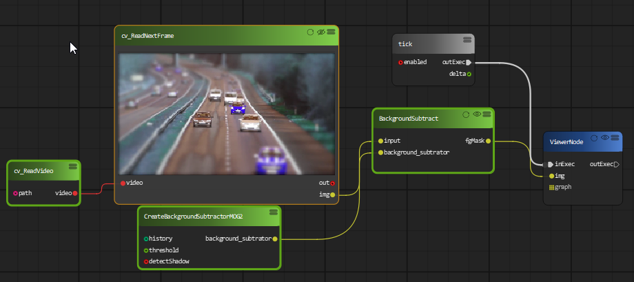
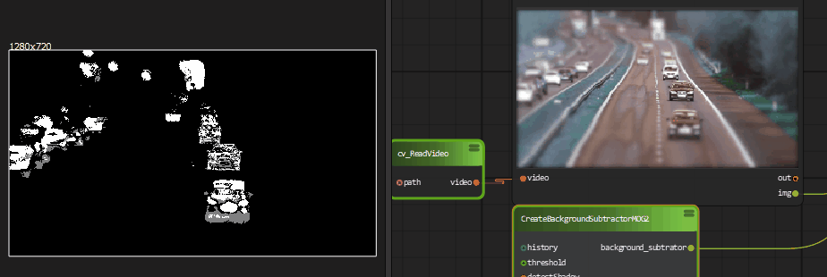

Background subtraction 
=============================
Background subtraction (BS) is a common and widely used technique for generating a foreground mask
In PyFlowOpenCv we implemented two BS model by using OpenCV MOG2 and KNN.

First we need to create a CreateBackgroundSubtractorMOG2 or CreateBackgroundSubtractorKNN block and connect to a BackgroundSubtract block.

You can also change the parameter of background subtractor model on realtime.

